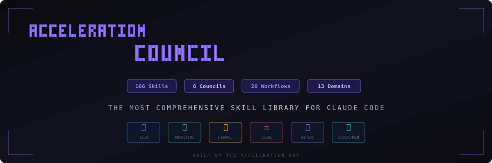

<p align="center">
  <br/>
  
  <br/>
</p>

<p align="center">
  
  
  
  
</p>

<p align="center">
  <a href="#quick-start">Quick Start</a> ·
  <a href="#the-councils">The Councils</a> ·
  <a href="#skill-domains">Skill Domains</a> ·
  <a href="#how-it-works">How It Works</a> ·
  <a href="#workflow-recipes">Workflows</a>
</p>

---

## What is Acceleration Council?

**Acceleration Council** is a plug-and-play skill library for [Claude Code](https://github.com/anthropics/claude-code). It gives Claude deep domain expertise across 13 disciplines — from frontend engineering to DeFi protocols, from marketing copywriting to legal compliance.

Each skill contains **decision trees**, **quality rubrics**, **research protocols**, and **cross-skill handoffs** — so Claude doesn't just write code, it makes *expert-level decisions*.

Built by [**The Acceleration Guy**](https://github.com/yogi100x).

---

## Quick Start

```bash
# Clone the repo
git clone https://github.com/yogi100x/acceleration-council.git

# Install a single skill
mkdir -p .claude/skills/copywriting
cp acceleration-council/marketing/copywriting/SKILL.md .claude/skills/copywriting/

# Install a full category
cp -r acceleration-council/marketing/ .claude/skills/

# Install everything
cp -r acceleration-council/* .claude/skills/
```

Then run the **setup skill** to generate context files:

```
.claude/context/product-marketing.md
.claude/context/finance.md
.claude/context/legal.md
.claude/context/ai.md
.claude/context/tech.md
```

---

## The Councils

Six expert review panels, each simulating a room full of senior specialists who debate, challenge, and refine your work.

<table>
<tr>
<td width="33%" valign="top">

### 🏗️ Tech Council
**Principal Engineer** · **Security Architect** · **SRE Lead** · **DX Engineer** · **QA Director**

Reviews architecture, code quality, security posture, and operational readiness. Catches race conditions, missing error paths, and scalability gaps.

</td>
<td width="33%" valign="top">

### 📈 Marketing Council
**CMO** · **Growth Lead** · **Brand Strategist** · **Data Analyst** · **Content Director**

Reviews campaigns, copy, and growth strategies against industry benchmarks. Validates conversion assumptions and measurement plans.

</td>
<td width="33%" valign="top">

### 💰 Finance Council
**CFO** · **FP&A Director** · **Tax Advisor** · **Investor Relations** · **Revenue Ops**

Validates financial models, projections, and pricing strategy. Stress-tests assumptions and checks compliance (ASC 606, tax implications).

</td>
</tr>
<tr>
<td width="33%" valign="top">

### ⚖️ Legal Council
**General Counsel** · **Privacy Officer** · **IP Attorney** · **Employment Lawyer** · **Compliance Director**

Reviews contracts, policies, and compliance posture. Checks GDPR/CCPA compliance, IP ownership, and dispute resolution mechanisms.

</td>
<td width="33%" valign="top">

### 🤖 AI Governance Council
**AI Ethics Lead** · **ML Engineer** · **Fairness Researcher** · **Product Safety** · **Regulatory Specialist**

Evaluates AI systems for safety, fairness, and compliance. Tests for bias, validates monitoring, and checks regulatory alignment.

</td>
<td width="33%" valign="top">

### ⛓️ Blockchain Council
**Smart Contract Auditor** · **Tokenomics Analyst** · **DeFi Security** · **Gas Optimization Expert** · **Web3 UX Researcher**

Audits smart contracts, tokenomics, and protocol safety. Catches reentrancy bugs, oracle manipulation risks, and gas inefficiencies.

</td>
</tr>
</table>

> Every council uses **cross-member deliberation** — members respond to each other's findings — plus a **devil's advocate** who challenges the consensus.

---

## Skill Domains

<table>
<tr>
<td width="50%" valign="top">

### 💻 Tech — 101 skills

| Sub-Category | Count | Highlights |
|:------------|:-----:|:-----------|
| **Frontend** | 12 | React patterns, SSR, state, a11y, animations, PWA |
| **Backend** | 12 | Caching, queues, real-time, search, rate limiting |
| **UI Engineering** | 10 | Design systems, theming, data viz, drag & drop |
| **AI Engineering** | 12 | RAG, embeddings, agents, eval, streaming, safety |
| **Blockchain** | 10 | Smart contracts, DeFi, NFTs, tokenomics, DAOs |
| **Data** | 8 | Modeling, ETL, warehousing, streaming, privacy |
| **DevOps** | 8 | Containers, IaC, secrets, DR, observability |
| **Mobile** | 8 | Architecture, React Native, offline-first, push |
| **Systems** | 6 | Algorithms, distributed, concurrency, protocols |
| **Standalone** | 15 | Architecture, security, auth, CI/CD, testing |

</td>
<td width="50%" valign="top">

### 📊 Business — 63 skills

| Category | Count | Highlights |
|:---------|:-----:|:-----------|
| **Marketing** | 25 | CRO, copywriting, SEO, ads, email, growth |
| **Finance** | 13 | Modeling, unit economics, fundraising, billing |
| **Legal** | 13 | Privacy, contracts, compliance, IP, employment |
| **AI Governance** | 12 | Ethics, bias testing, monitoring, red teaming |

</td>
</tr>
</table>

---

## How It Works

Skills don't operate in isolation. Three protocols connect them into a coherent system:

```
┌─────────────┐     ┌─────────────┐     ┌─────────────┐
│  RESEARCH    │     │  HANDOFF     │     │ ORCHESTRATOR │
│  PROTOCOL    │     │  PROTOCOL    │     │              │
├─────────────┤     ├─────────────┤     ├──────────────┤
│ WebSearch    │     │ Skill A      │     │ Analyze task │
│ for latest   │────▶│ writes to    │────▶│ Select skills│
│ versions     │     │ .claude/     │     │ Resolve deps │
│ before every │     │ outputs/     │     │ Track state  │
│ skill runs   │     │              │     │              │
│              │     │ Skill B      │     │ Conditional  │
│ WebFetch     │     │ reads from   │     │ branching    │
│ official     │     │ .claude/     │     │              │
│ docs         │     │ outputs/     │     │ Quality gates│
└─────────────┘     └─────────────┘     └──────────────┘
```

### The Orchestrator

The **orchestrator** is a meta-skill that runs first. It:

1. **Analyzes** your task across 4 axes (type, scale, stage, urgency)
2. **Detects** which domains are involved via signal words
3. **Selects** specific skills with conditional branching
4. **Resolves** dependency order across 8 execution layers
5. **Tracks** progress and quality gates (28+/35 rubric score to pass)
6. **Routes** to the right council for review

```
Layer 0: Context          → setup/context-generation
Layer 1: Architecture     → system-architecture, database-schema
Layer 2: Contracts        → api-design, auth-design
Layer 3: Implementation   → frontend, backend, mobile, AI (parallel)
Layer 4: Quality          → testing, security, performance
Layer 5: Operations       → CI/CD, containers, monitoring
Layer 6: Go-to-Market     → marketing, finance, legal
Layer 7: Review           → council reviews
```

---

## Workflow Recipes

20 pre-built skill chains for common tasks. [See all workflows →](workflows/README.md)

| # | Workflow | Skills | Domain |
|:-:|:---------|:------:|:-------|
| 1 | **New Product Launch** | 9 | Finance → Marketing |
| 2 | **Landing Page Optimization** | 6 | Marketing |
| 3 | **SaaS Pricing Overhaul** | 5 | Finance + Marketing |
| 4 | **Content Marketing Engine** | 6 | Marketing |
| 5 | **AI Feature Deployment** | 6 | AI Governance |
| 6 | **New SaaS Application** | 9 | Tech (full stack) |
| 7 | **Compliance & Legal Foundation** | 6 | Legal |
| 8 | **Fundraising Preparation** | 5 | Finance |
| 9 | **Growth Optimization Sprint** | 5 | Marketing |
| 10 | **Security & Compliance Audit** | 6 | Tech + Legal |
| 11 | **AI System Audit** | 6 | AI Governance |
| 12 | **Marketplace Launch** | 7 | Tech + Legal + Marketing |
| 13 | **Full-Stack Feature** | 8 | Frontend + Backend |
| 14 | **AI Feature with RAG** | 7 | AI Engineering |
| 15 | **DeFi Protocol** | 6 | Blockchain |
| 16 | **Mobile App Launch** | 7 | Mobile + DevOps |
| 17 | **Data Platform** | 6 | Data + DevOps |
| 18 | **Design System** | 5 | UI + Frontend |
| 19 | **Real-Time Feature** | 5 | Backend + Frontend |
| 20 | **Infrastructure Setup** | 6 | DevOps |

---

## Project Structure

```
acceleration-council/
├── setup/                        # Orchestrator + context generation
│   └── orchestrator/             # Meta-skill: maps tasks → skill sequences
├── shared/
│   ├── references/               # Benchmarks, anti-patterns, industry profiles
│   └── SKILL-TEMPLATE.md         # Template for creating new skills
├── marketing/         (25 skills)
├── finance/           (13 skills)
├── legal/             (13 skills)
├── ai-governance/     (12 skills)
├── tech/             (101 skills)
│   ├── frontend/      (12)
│   ├── backend/       (12)
│   ├── ui/            (10)
│   ├── ai-engineering/(12)
│   ├── blockchain/    (10)
│   ├── data/           (8)
│   ├── devops/         (8)
│   ├── mobile/         (8)
│   ├── systems/        (6)
│   └── (15 standalone)
├── councils/           (6 councils)
├── workflows/          (20 recipes)
└── docs/
```

---

## Quality System

Every skill output is scored against a **35-point rubric** (7 dimensions × 5 points):

| Dimension | 5 pts | 3 pts | 1 pt |
|:----------|:------|:------|:-----|
| **Correctness** | Provably correct, all edge cases | Common cases covered | Known bugs |
| **Performance** | Benchmarked, meets targets | Reasonable | Untested |
| **Scalability** | Handles 10x growth | Handles current load | Breaks under load |
| **Simplicity** | Simplest solution that works | Reasonable complexity | Over-engineered |
| **Testability** | Comprehensive + property tests | Unit tests | Untested |
| **Documentation** | Analysis + design rationale | Some docs | Undocumented |
| **Failure Handling** | Graceful degradation | Basic error handling | Crashes |

> **28+ = Ship it** · **21-27 = Needs hardening** · **<21 = Fragile, do not ship**

---

## Contributing

Want to add a skill? Use the [SKILL-TEMPLATE.md](shared/SKILL-TEMPLATE.md) as your starting point. Every skill must include:

- Research Protocol (web search for latest versions)
- Decision Tree (structured decision-making)
- Quality Rubric (35-point scoring)
- Output Protocol (write to `.claude/outputs/`)

---

## License

MIT

---

<p align="center">
  <strong>Built by <a href="https://github.com/yogi100x">The Acceleration Guy</a></strong>
  <br/>
  <em>Because expertise shouldn't be locked in someone's head.</em>
</p>
