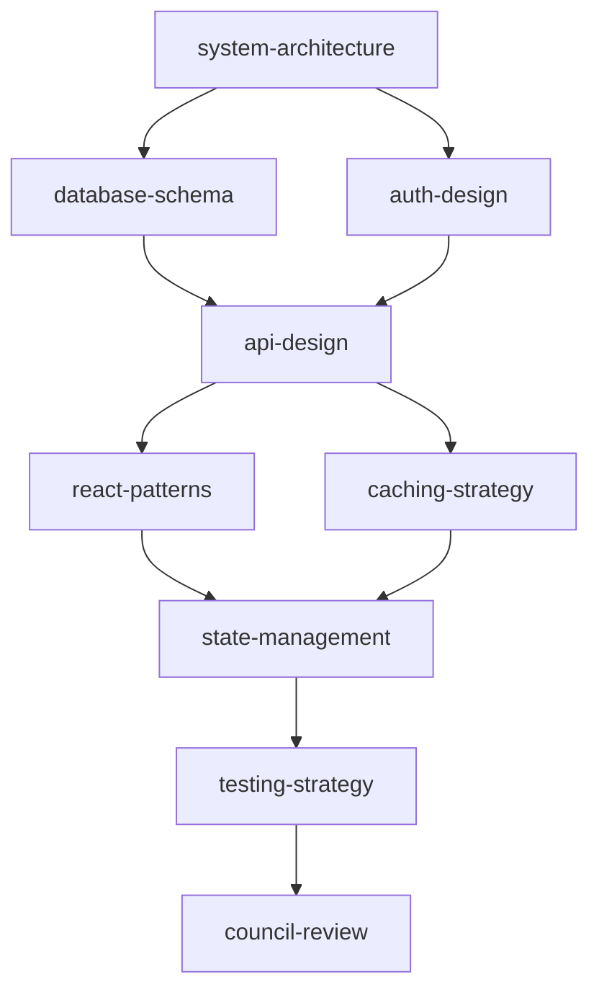

# Acceleration Council — Orchestrator

The meta-skill that powers every task. Run this FIRST — it analyzes your task, selects the right skills, resolves dependencies, manages execution state, and routes to council reviews.

## How It Works

```
Task → Analyze → Select Skills → Resolve Order → Execute → Track → Review
```

---

## Phase 1: Task Analysis

### 1.1 Classify the Task

Read the user's request and classify along 4 axes:

| Axis | Options |
|------|---------|
| **Type** | `build` · `fix` · `optimize` · `audit` · `migrate` · `launch` · `plan` · `redesign` |
| **Scale** | `single-skill` (1-2 skills) · `workflow` (3-8) · `initiative` (9+) |
| **Stage** | `greenfield` · `existing-codebase` · `refactor` · `maintenance` |
| **Urgency** | `explore` (learn first) · `execute` (build now) · `ship` (deploy today) |

### 1.2 Detect Domains

Scan the task description for domain signals:

| Signal Words | Domain | Skill Category |
|-------------|--------|----------------|
| component, page, UI, layout, responsive, animation | **Frontend** | `tech/frontend/` |
| API, endpoint, cache, queue, webhook, rate limit | **Backend** | `tech/backend/` |
| design system, theme, table, chart, modal, drag | **UI Engineering** | `tech/ui/` |
| LLM, RAG, embedding, prompt, agent, fine-tune | **AI Engineering** | `tech/ai-engineering/` |
| smart contract, token, DeFi, NFT, wallet, gas | **Blockchain** | `tech/blockchain/` |
| schema, migration, ETL, warehouse, pipeline | **Data** | `tech/data/` |
| deploy, container, CI/CD, secrets, infra, scaling | **DevOps** | `tech/devops/` |
| mobile, app, React Native, push, offline, app store | **Mobile** | `tech/mobile/` |
| algorithm, distributed, concurrency, protocol | **Systems** | `tech/systems/` |
| pricing, revenue, fundraise, budget, cap table | **Finance** | `finance/` |
| copy, landing page, SEO, ads, email, conversion | **Marketing** | `marketing/` |
| privacy, terms, compliance, GDPR, contract | **Legal** | `legal/` |
| bias, fairness, AI ethics, monitoring, red team | **AI Governance** | `ai-governance/` |

**Rule:** If 0 domains detected, ask the user. If 1 domain, it's single-skill. If 2+, it's a workflow.

### 1.3 Check Existing Outputs

Before selecting skills, check what already exists:

```bash
ls .claude/outputs/   # Previous skill outputs
ls .claude/context/   # Context files from setup
```

Skip skills whose outputs already exist and are still current.

---

## Phase 2: Skill Selection

### 2.1 Match Task to Skills

For each detected domain, select specific skills:

**Frontend Domain:**
```
Building components? → react-patterns + component-architecture
Adding forms? → form-design + state-management
Need animations? → animation-design
SSR/SSG decision? → ssr-strategy
Performance issue? → bundle-optimization
Accessibility? → accessibility
PWA? → pwa-design
```

**Backend Domain:**
```
New API? → api-design + middleware-design
Need caching? → caching-strategy
Real-time? → real-time-architecture
Search feature? → search-implementation
Email system? → email-system
Background jobs? → scheduled-tasks + queue-architecture
Rate limiting? → rate-limiting
```

**AI Engineering Domain:**
```
Knowledge retrieval? → rag-architecture + vector-database
Embeddings needed? → embedding-strategy
Building AI agent? → agent-design + tool-use-design
Need evaluation? → eval-pipeline
Prompt management? → prompt-management
Streaming responses? → llm-streaming
Cost concerns? → ai-cost-optimization
Safety/guardrails? → ai-safety-engineering
Multi-modal? → multimodal-design
```

**Blockchain Domain:**
```
New contract? → smart-contract-design + smart-contract-security
Token economics? → tokenomics
DeFi protocol? → defi-patterns + gas-optimization
NFT project? → nft-architecture
Wallet connect? → wallet-integration
Cross-chain? → cross-chain-design
DAO? → dao-governance
On-chain data? → on-chain-data
```

**Data Domain:**
```
Schema design? → data-modeling
Slow queries? → query-optimization
ETL pipeline? → etl-pipeline
Analytics? → analytics-instrumentation
Data warehouse? → data-warehouse
Streaming? → streaming-data
Privacy compliance? → data-privacy-engineering
Data quality? → data-validation
```

**DevOps Domain:**
```
Containerize? → containerization
Infra setup? → infrastructure-as-code
Secrets? → secrets-management
Scaling? → scaling-strategy
DR plan? → disaster-recovery
Monitoring? → observability-platform
Networking? → network-design
Cloud costs? → cloud-cost-optimization
```

**Mobile Domain:**
```
New app? → mobile-architecture
React Native? → react-native-patterns
Performance? → mobile-performance
Push notifications? → push-notification-design
Auth flow? → mobile-auth
App store? → app-store-optimization
Offline support? → offline-first-design
Testing? → mobile-testing
```

**Systems Domain:**
```
Algorithm choice? → algorithm-selection
Distributed? → distributed-systems
Concurrency? → concurrency-patterns
Data structure? → data-structure-selection
Protocol design? → protocol-design
DSL/compiler? → compiler-interpreter-design
```

### 2.2 Add Cross-Cutting Skills

These skills are triggered automatically based on conditions:

| Condition | Auto-Add Skill |
|-----------|---------------|
| Any new system | `system-architecture` (if not already selected) |
| Any database work | `database-schema` |
| Any user-facing feature | `auth-design` |
| Any API | `error-handling` |
| Handles user data | `legal/privacy-policy` + `data-privacy-engineering` |
| Money/payments involved | `finance/pricing-model` + `legal/terms-of-service` |
| AI/ML feature | `ai-governance/ai-monitoring-setup` |
| Going to production | `security-hardening` + `monitoring-setup` + `testing-strategy` |
| Scale concerns | `performance-optimization` + `scaling-strategy` |

### 2.3 Select Council

| Primary Domain | Council | When |
|---------------|---------|------|
| Tech (any) | `council-review` | After implementation plan |
| Blockchain | `council-blockchain` | After contract design |
| Marketing | `council-marketing` | After campaign design |
| Finance | `council-finance` | After financial model |
| Legal | `council-legal` | After policy drafts |
| AI/ML | `council-ai` | After AI system design |
| Multi-domain | Multiple councils | One per domain |

---

## Phase 3: Dependency Resolution

### 3.1 Build Dependency Graph

Skills have natural dependencies. Order them:

**Layer 0 — Context (always first):**
```
setup/context-generation → produces .claude/context/*.md
```

**Layer 1 — Architecture (decisions that constrain everything):**
```
system-architecture
database-schema (reads: system-architecture)
data-modeling (reads: system-architecture)
```

**Layer 2 — Contracts (interfaces between systems):**
```
api-design (reads: system-architecture, database-schema)
auth-design (reads: system-architecture)
smart-contract-design (reads: system-architecture)
```

**Layer 3 — Implementation (can often parallelize):**
```
Frontend skills (read: api-design)          ← parallel
Backend skills (read: api-design, database) ← parallel
Mobile skills (read: api-design)            ← parallel
AI skills (read: api-design, database)      ← parallel
Blockchain skills (read: contract-design)   ← parallel
```

**Layer 4 — Quality (after implementation):**
```
testing-strategy (reads: all implementation outputs)
security-hardening (reads: all implementation outputs)
performance-optimization (reads: all implementation outputs)
```

**Layer 5 — Operations (after quality):**
```
ci-cd-pipeline (reads: testing-strategy)
containerization (reads: system-architecture)
monitoring-setup (reads: all above)
disaster-recovery (reads: infrastructure)
```

**Layer 6 — Go-to-Market (after operations):**
```
Marketing skills (read: product context)
Finance skills (read: pricing decisions)
Legal skills (read: data handling decisions)
```

**Layer 7 — Review (always last):**
```
Council reviews (read: all outputs)
```

### 3.2 Parallelization Rules

Skills in the same layer with no shared dependencies can run in parallel:

```
PARALLEL OK:
  - frontend/react-patterns + backend/caching-strategy (different domains)
  - mobile/mobile-auth + frontend/accessibility (independent)

MUST BE SEQUENTIAL:
  - database-schema → api-design (API reads schema)
  - api-design → frontend/state-management (state reads API contract)
  - smart-contract-design → smart-contract-security (security audits design)
```

### 3.3 Conditional Branches

Some skills are only needed if a condition is met during execution:

```
IF system-architecture outputs "microservices":
  ADD api-gateway, queue-architecture, distributed-systems

IF system-architecture outputs "monolith":
  SKIP api-gateway, queue-architecture

IF database-schema outputs "real-time needed":
  ADD real-time-architecture, client-state-sync

IF auth-design outputs "OAuth/SSO":
  ADD legal/privacy-policy (third-party data)

IF ai-engineering skills selected AND production:
  ADD ai-safety-engineering, ai-monitoring-setup, eval-pipeline

IF blockchain skills selected:
  ADD smart-contract-security (ALWAYS, non-negotiable)
```

---

## Phase 4: Generate Execution Plan

Write the plan to `.claude/outputs/execution-plan.md`:

```markdown
# Execution Plan: [Task Description]

**Type:** [build/fix/optimize/audit/migrate/launch]
**Scale:** [single-skill/workflow/initiative]
**Domains:** [frontend, backend, AI, ...]
**Total Skills:** [N]
**Estimated Phases:** [N]

## Dependency Graph



## Execution Phases

### Phase 1: Foundation
| # | Skill | Reads From | Writes To | Status |
|---|-------|-----------|-----------|--------|
| 1 | `system-architecture` | `.claude/context/tech.md` | `.claude/outputs/system-architecture.md` | ⬜ |
| 2 | `database-schema` | #1 output | `.claude/outputs/database-schema.md` | ⬜ |

### Phase 2: Contracts
| # | Skill | Reads From | Writes To | Status |
|---|-------|-----------|-----------|--------|
| 3 | `api-design` | #1, #2 outputs | `.claude/outputs/api-design.md` | ⬜ |
| 4 | `auth-design` | #1 output | `.claude/outputs/auth-design.md` | ⬜ |

### Phase 3: Implementation (parallel)
| # | Skill | Reads From | Writes To | Status |
|---|-------|-----------|-----------|--------|
| 5 | `react-patterns` | #3 output | `.claude/outputs/react-patterns.md` | ⬜ |
| 6 | `caching-strategy` | #3 output | `.claude/outputs/caching-strategy.md` | ⬜ |

### Phase 4: Quality
| # | Skill | Reads From | Writes To | Status |
|---|-------|-----------|-----------|--------|
| 7 | `testing-strategy` | all above | `.claude/outputs/testing-strategy.md` | ⬜ |

### Phase 5: Review
| # | Skill | Reads From | Writes To | Status |
|---|-------|-----------|-----------|--------|
| 8 | `council-review` | all outputs | `.claude/outputs/council-review.md` | ⬜ |

## Conditional Branches (evaluated during execution)
- [ ] IF #1 outputs "microservices" → ADD `api-gateway`, `queue-architecture`
- [ ] IF #3 outputs "real-time" → ADD `real-time-architecture`

## Open Questions
- [List anything unclear that should be resolved before Phase 2]
```

---

## Phase 5: Execution Loop

For each skill in the plan:

### 5.1 Pre-Flight Check
```
1. Run Research Protocol (WebSearch for latest versions)
2. Read upstream outputs from .claude/outputs/
3. Read context from .claude/context/
4. Verify all inputs are available
```

### 5.2 Execute Skill
```
1. Follow the skill's decision tree
2. Make and document decisions
3. Write output to .claude/outputs/[skill-name].md
```

### 5.3 Post-Execution Check
```
1. Verify output file was written
2. Check quality rubric score (must be 28+/35)
3. Evaluate conditional branches — add new skills if triggered
4. Update execution plan status: ⬜ → ✅
5. Check if next phase is unblocked
```

### 5.4 Error Handling
```
IF skill fails quality rubric (<28/35):
  → Re-run with specific feedback on weak dimensions

IF upstream output is missing:
  → Run the upstream skill first (dependency was missed)

IF conditional branch triggers new skills:
  → Insert them into the plan at the correct layer
  → Re-resolve dependencies

IF user changes requirements mid-execution:
  → Re-run Phase 1 (Task Analysis) with updated context
  → Diff the new plan against current progress
  → Keep completed skills, re-plan remaining
```

---

## Phase 6: Completion

### 6.1 Verify All Outputs
```bash
# Check all expected outputs exist
ls .claude/outputs/

# Verify each output has content (not empty)
wc -l .claude/outputs/*.md
```

### 6.2 Generate Summary
Write to `.claude/outputs/execution-summary.md`:

```markdown
# Execution Summary

**Task:** [description]
**Skills Executed:** [N] of [N planned]
**Conditional Branches Triggered:** [list]
**Council Verdict:** [Ship It / N issues found]
**Quality Scores:** [list each skill's rubric score]

## Key Decisions Made
1. [Decision from skill X] — chose Y because Z
2. ...

## Outputs Generated
- .claude/outputs/system-architecture.md
- .claude/outputs/database-schema.md
- ...

## Deferred Items
- [Anything marked for later]
```

---

## Quick Reference: Common Task → Full Skill Chain

### "Build a full-stack feature"
```
system-architecture → database-schema → api-design → auth-design
  → react-patterns + caching-strategy (parallel)
  → state-management → testing-strategy → security-hardening
  → monitoring-setup → council-review
```

### "Build an AI chatbot"
```
system-architecture → database-schema → api-design
  → rag-architecture → embedding-strategy → vector-database
  → prompt-management → llm-streaming → tool-use-design
  → eval-pipeline → ai-safety-engineering
  → ai-monitoring-setup → council-review + council-ai
```

### "Launch a DeFi protocol"
```
system-architecture → smart-contract-design → tokenomics
  → defi-patterns → smart-contract-security → gas-optimization
  → wallet-integration → dao-governance
  → on-chain-data → testing-strategy
  → council-blockchain + council-review
  → launch-strategy → content-strategy → council-marketing
```

### "Ship a mobile app"
```
system-architecture → database-schema → api-design → auth-design
  → mobile-architecture → react-native-patterns → mobile-auth
  → push-notification-design → offline-first-design
  → mobile-performance → mobile-testing
  → app-store-optimization
  → council-review
```

### "Build a data platform"
```
system-architecture → data-modeling → database-schema
  → etl-pipeline → data-warehouse → streaming-data
  → data-validation → data-privacy-engineering
  → analytics-instrumentation → query-optimization
  → observability-platform → council-review
```

### "Set up infrastructure from scratch"
```
system-architecture → containerization → infrastructure-as-code
  → secrets-management → ci-cd-pipeline → network-design
  → observability-platform → scaling-strategy
  → disaster-recovery → cloud-cost-optimization
  → security-hardening → council-review
```

### "Audit an existing system"
```
security-hardening → auth-design → performance-optimization
  → testing-strategy → code-review-checklist
  → compliance-checklist → privacy-policy
  → monitoring-setup → incident-response-plan
  → council-review + council-legal
```

### "Launch a new SaaS product"
```
[All tech skills for the product]
  → pricing-model → billing-design → financial-model
  → privacy-policy → terms-of-service → cookie-consent
  → launch-strategy → content-strategy → copywriting
  → email-sequence → analytics-tracking → paid-ads
  → council-review + council-finance + council-legal + council-marketing
```

---

## Cross-Skill References

- **This skill is upstream of everything** — it determines what runs
- **Reads:** `.claude/context/*`, `.claude/outputs/*` (existing outputs)
- **Writes:** `.claude/outputs/execution-plan.md`, `.claude/outputs/execution-summary.md`
- **Council:** No council review needed for the orchestrator itself
